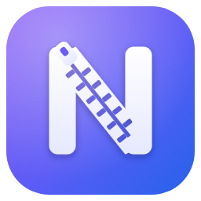

<h1 align="center">NZip</h1>

<b>Smaller, verified and repairable archives — for Windows, macOS and Linux.</b>

    

<b>English</b> · <a href="README.it.md">Italiano</a> · <a href="README.es.md">Español</a> · <a href="README.fr.md">Français</a> · <a href="README.de.md">Deutsch</a> · <a href="README.ru.md">Русский</a> · <a href="README.zh.md">中文</a>

<a href="https://nzip-app.github.io/en/"><b>Website</b></a> · <a href="https://github.com/nzip-app/nzip-app.github.io/releases/latest/download/NZip-Setup.exe"><b>Download for Windows</b></a> · <a href="https://github.com/nzip-app/nzip-app.github.io/releases/latest">Latest release: 3.2.7</a>

---

NZip is a modern file compressor. It creates .nzip archives that are smaller than those produced by 7-Zip and RAR, reads back and verifies every file before reporting an operation as complete, and also opens archives created by other programs: ZIP, RAR, 7z, TAR, ISO and many more. The base edition is free for everyone, including for business use.

## At a glance

- **Smaller**: PNG pixels stored as lossless JPEG XL, lossless recompression of JPEG, ZIP and Office documents, and modern compressors selected for each type of data.
- **Verified**: every file is compared with the original (BLAKE3) before the archive is closed, and again on extraction.
- **Repairable**: recovery data makes it possible to restore damaged archives.
- **Secure**: AES-256 encryption of both contents and file names; with NZip Pro, also digital signatures and recipient-based encryption.
- **Compatible**: reads and extracts ZIP, RAR, 7z, TAR, GZ, BZ2, XZ, ZSTD, LZH, ARJ, CAB, ISO and WIM, and converts them to .nzip.
- **Integrated**: File Explorer menus (Windows 11 and 10), Finder, Dolphin, Nautilus and Nemo; 7 languages.

## Benchmarks

Size of the archives produced from the same folders on the same PC. Every archive was extracted and compared byte for byte with the original.

**Documents** · 723.6 MB — 981 real documents: PDF, Word, Excel, PowerPoint, HTML (Govdocs1)

| Program | Size | vs. 7-Zip ultra |
|---|---:|---:|
| ZIP (maximum) | 454.5 MB | +9.0% |
| RAR 7 (best, solid) | 431.3 MB | +3.4% |
| tar.xz (xz, maximum) | 416.9 MB | −0.0% |
| tar.zst (zstd 19, long) | 396.6 MB | −4.9% |
| 7-Zip ultra | 417.0 MB | — |
| **NZip normal** | 328.2 MB | **−21.3%** |
| **NZip maximum** | 324.1 MB | **−22.3%** |

**Images** · 147.6 MB — 24 PNGs from the Kodak Image Suite and 40 original NASA JPEG photos

| Program | Size | vs. 7-Zip ultra |
|---|---:|---:|
| ZIP (maximum) | 145.7 MB | +0.4% |
| RAR 7 (best, solid) | 145.9 MB | +0.5% |
| tar.xz (xz, maximum) | 145.1 MB | +0.0% |
| tar.zst (zstd 19, long) | 145.1 MB | −0.0% |
| 7-Zip ultra | 145.1 MB | — |
| **NZip normal** | 114.9 MB | **−20.8%** |
| **NZip maximum** | 114.2 MB | **−21.3%** |

**Source code backups** · 303.8 MB — a project's backup folder: 3 consecutive releases of the Python sources (3.13.5, 3.13.6, 3.13.7)

| Program | Size | vs. 7-Zip ultra |
|---|---:|---:|
| ZIP (maximum) | 87.9 MB | +173.4% |
| RAR 7 (best, solid) | 25.9 MB | −19.4% |
| tar.xz (xz, maximum) | 33.7 MB | +4.8% |
| tar.zst (zstd 19, long) | 22.9 MB | −28.8% |
| 7-Zip ultra | 32.1 MB | — |
| **NZip normal** | 21.2 MB | **−34.2%** |
| **NZip maximum** | 20.6 MB | **−35.8%** |

**Source code** · 101.3 MB — official Python 3.13.7 sources (text, C and Python)

| Program | Size | vs. 7-Zip ultra |
|---|---:|---:|
| ZIP (maximum) | 29.3 MB | +39.3% |
| RAR 7 (best, solid) | 23.4 MB | +11.2% |
| tar.xz (xz, maximum) | 21.1 MB | +0.4% |
| tar.zst (zstd 19, long) | 21.7 MB | +3.4% |
| 7-Zip ultra | 21.0 MB | — |
| **NZip normal** | 20.7 MB | **−1.6%** |
| **NZip maximum** | 20.3 MB | **−3.6%** |

NZip times include full verification of the archive, which the other programs don't do. Green and red percentages are relative to 7-Zip ultra.

[Full details, timings and additional formats are available on the website.](https://nzip-app.github.io/en/#benchmark)

## Download

| Platform | File |
|---|---|
| Windows 10 and 11 (64-bit) — Installer | [NZip-Setup.exe](https://github.com/nzip-app/nzip-app.github.io/releases/latest/download/NZip-Setup.exe) |
| Windows 10 and 11 (64-bit) — MSI package | [NZip.msi](https://github.com/nzip-app/nzip-app.github.io/releases/latest/download/NZip.msi) |
| ADMX enterprise policy templates | [NZip-ADMX.zip](https://github.com/nzip-app/nzip-app.github.io/releases/latest/download/NZip-ADMX.zip) |
| macOS — Apple Silicon | [NZip-macos-arm64.zip](https://github.com/nzip-app/nzip-app.github.io/releases/latest/download/NZip-macos-arm64.zip) |
| macOS — Intel | [NZip-macos-x64.zip](https://github.com/nzip-app/nzip-app.github.io/releases/latest/download/NZip-macos-x64.zip) |
| Linux — x86-64 | [NZip-linux-x64.tar.gz](https://github.com/nzip-app/nzip-app.github.io/releases/latest/download/NZip-linux-x64.tar.gz) |
| Linux — ARM64 | [NZip-linux-arm64.tar.gz](https://github.com/nzip-app/nzip-app.github.io/releases/latest/download/NZip-linux-arm64.tar.gz) |

The macOS and Linux versions are in preview. Verify the integrity of the downloaded files with [SHA256SUMS.txt](https://github.com/nzip-app/nzip-app.github.io/releases/latest/download/SHA256SUMS.txt).

## System requirements

- Windows 10 or 11, 64-bit (x64)
- macOS 13 or later (Apple Silicon or Intel) — preview
- Linux x86-64 or ARM64 with glibc 2.28 or later — preview

## Editions

- **NZip** — free for everyone, individuals and businesses alike, for any purpose.
- **NZip Pro** — personal license: Ultra compression, split and self-extracting archives, digital signatures, scheduled backups, search inside archives, copy to cloud.
- **NZip Enterprise** — per-seat business license: enterprise policies, recovery key, activity log, MSI, SDK.

**NZip Pro · NZip Enterprise** — How to get it: open NZip → Settings → Upgrade to Pro or Enterprise, enter your details and send the request. You'll receive a license key to paste into the app: it activates instantly, even offline.

The base edition is free forever. Pro and Enterprise are requested directly from the app.

## ☕ Support NZip

NZip is free for everyone and will stay that way. If it saves you time and space, buy me a coffee: even a small contribution on PayPal makes a difference. Thank you!

## License

NZip is proprietary software; the base edition is distributed free of charge. Its use is governed by the **End User License Agreement (EULA)**, which is displayed and accepted during installation. The source code is not public; the .nzip format is openly documented.

- 📦 [Third-party component licenses](legal/TERZE-PARTI.txt)
- The 7-Zip engine (7z.dll), used solely to read archives created by other programs, is distributed under the GNU LGPL with the unRAR restriction; the full license texts are included with the application. [7-Zip-26.02-src.7z](https://github.com/nzip-app/nzip-app.github.io/releases/latest/download/7-Zip-26.02-src.7z)

## Documentation

- [.nzip format specification](docs/NZIP-FORMAT.md)
- [Developer SDK](docs/SDK.md)
- [Release notes](https://github.com/nzip-app/nzip-app.github.io/releases)

## Feedback and bug reports

Found a problem or have a suggestion? Please open an issue in the [Issues](https://github.com/nzip-app/nzip-app.github.io/issues) section of this repository. Or contact support through the website: [contact support](https://nzip-app.github.io/en/).

---

© 2026 Marco Cavallo. All rights reserved. NZip, the NZip name and logo belong to Marco Cavallo, creator and author of the software.
